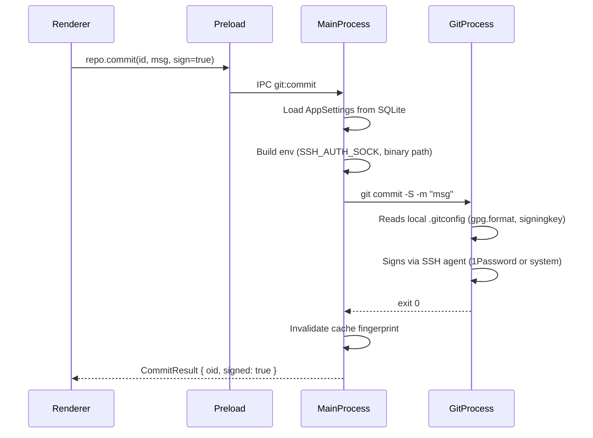

# Gitagen v1 Plan: Fast Electron Git Client (Tailwind + SQLite Cache)

## Summary

Build a macOS-first Electron app with a two-pane layout:

- Left sidebar: `Projects` section on top, collapsible repository file tree, worktree panel.
- Center panel: diff viewer using `@pierre/diffs` (`PatchDiff`) with `unstaged` and `staged` toggle, plus commit panel, branch selector, and full git workflow controls.

Core goals:

- Very fast startup (interactive under 500ms).
- Fast project switching and diff loading via SQLite-backed cache.
- Use `simple-git` first, with a pluggable git adapter layer for fallback/custom git commands when needed.
- Full git workflow: stage, commit, push, pull, branch, merge, rebase, stash, tags, cherry-pick.
- Per-project gitconfig, SSH/1Password commit signing, worktrees, dark/light mode.

---

## 1. Git Binary Selection (Settings)

- App-wide setting `gitBinaryPath` — either auto-detected (default) or user-specified absolute path.
- `simple-git` supports a custom binary via its constructor: `simpleGit({ binary: '/opt/homebrew/bin/git' })`.
- Settings persisted in SQLite (`app_settings` table).
- The Settings panel lets the user browse/select a git binary with a native file dialog.
- On startup, validate the configured binary by running `git --version`; fall back to PATH-resolved git if invalid.

---

## 2. SSH Commit Signing (including 1Password SSH Agent)

Git-level config, surfaced and configurable in the app:

- **Signing format**: `gpg.format = ssh` (or `gpg` / `openpgp` for GPG users).
- **Signing key**: `user.signingkey` — path to SSH public key or key fingerprint.
- **Auto-sign**: `commit.gpgsign = true`.
- **1Password SSH agent**: detected at `~/Library/Group Containers/2BUA8C4S2C.com.1password/t/agent.sock`. When found, offer to set `SSH_AUTH_SOCK` in the git process environment.
- **Allowed signers**: `gpg.ssh.allowedSignersFile` — for verifying signed commits.

Implementation:

- When spawning git processes, inject `SSH_AUTH_SOCK` and `GIT_SSH_COMMAND` into the child process environment as needed.
- `simple-git` supports environment variables via `env` option in its constructor.
- Settings UI: section for "Commit Signing" with format selector, key input, 1Password agent toggle (auto-detected), and a "Test signing" button.
- All signing config is written via `git config` at the appropriate scope (local or global), not stored separately.

---

## 3. Gitconfig Resolution (Per-Project / Per-Folder)

Git already resolves config hierarchically (system > global > local > worktree). The app must:

- Always spawn git with the correct `cwd` set to the project/worktree path so `.git/config` and `includeIf` directives resolve correctly.
- Expose `repo.getEffectiveConfig(projectId)` IPC to show the merged config and its origins (`git config --list --show-origin --show-scope`).
- Allow editing select config keys from the Settings panel at the local (repo) scope.
- Display the active gitconfig source chain in the project settings view.
- Respect `GIT_DIR`, `GIT_WORK_TREE`, and `includeIf` without overriding them.

---

## 4. Worktree Support

Worktrees are stored under `~/.gitagen/<project-name>/<5-random-words-joined-by-dashes>/`.

- **Naming**: Generate names from a built-in word list (e.g., 2048 common English words). Example: `brave-ocean-swift-morning-delta`.
- **Service** (`src/main/services/worktree/`):
    - `listWorktrees(repoPath)` — `git worktree list --porcelain`
    - `addWorktree(repoPath, branch, newBranch?)` — creates worktree at the conventional path
    - `removeWorktree(repoPath, worktreePath)` — `git worktree remove`
    - `pruneWorktrees(repoPath)` — `git worktree prune`
    - Ensure `~/.gitagen/<project>/` directory structure is created/cleaned up.
- **UI**: Worktree panel in sidebar showing all worktrees for the current project. Actions: add (with branch picker), switch (opens worktree as active context), remove.
- **Project model change**: `Project` gains `worktrees: WorktreeInfo[]` and `activeWorktreePath?: string`.

---

## 5. Dark / Light Mode Toggle

Minimal for now — full theming deferred to a later iteration.

- Use Tailwind's `dark:` class strategy with a `<html class="dark">` toggle.
- Theme state stored in SQLite `app_settings` with three values: `"dark"`, `"light"`, `"system"`.
- Theme context provider (`src/renderer/src/theme/provider.tsx`) reads OS preference via `matchMedia('(prefers-color-scheme: dark)')` for `"system"` mode.
- Toggle button in the app titlebar or settings panel.
- All existing Tailwind classes get `dark:` counterparts (zinc-950 for dark, white/zinc-50 for light).

---

## 6. SQLite Local Cache and Data Store

- **Dependency**: Add `better-sqlite3` + `@types/better-sqlite3`.
- **DB location**: `app.getPath('userData')/gitagen.db`.
- **Service** (`src/main/services/cache/`):
    - `sqlite.ts` — DB init, schema creation, migrations via a `schema_version` table.
    - `queries.ts` — typed query functions for each table.
    - `retention.ts` — LRU (500MB cap) + TTL (30 days) cleanup, runs on startup and every 30 minutes.

**Schema (6 tables)**:

- `app_settings` — key/value pairs for global settings (git binary, theme, signing config).
- `projects` — id, name, path, lastOpenedAt, createdAt.
- `project_prefs` — per-project UI state (expanded dirs, selected file, scroll positions, filters).
- `repo_cache` — keyed by (projectId, fingerprint): tree snapshots, status snapshots.
- `patch_cache` — keyed by (projectId, filePath, scope, fingerprint): cached diffs.
- `schema_version` — single-row migration tracker.

**Retention policy**:

- LRU cap 500MB.
- TTL 30 days.
- Cleanup on startup and periodically in background.

**Fingerprint/invalidation**:

- Fingerprint = `{ repoPath, headOid, indexMtimeMs, statusHash }`.
- Tree/status caches keyed by project + fingerprint + includeIgnored flag.
- Patch cache keyed by project + filePath + scope + fingerprint.
- On refresh or fs/git change, stale keys are invalidated.

---

## 7. Full Git Workflow

### Staging Area

- `repo.stageFiles(projectId, paths[])` — `git add`
- `repo.unstageFiles(projectId, paths[])` — `git restore --staged`
- `repo.stageAll(projectId)` — `git add -A`
- `repo.unstageAll(projectId)` — `git reset HEAD`
- `repo.discardFiles(projectId, paths[])` — `git restore`
- `repo.discardAllUnstaged(projectId)` — `git restore .`

### Commit

- `repo.commit(projectId, { message, amend?, sign? })` — `git commit`
- `repo.getLog(projectId, { limit?, branch?, offset? })` — `git log` with parsed output

### Branches

- `repo.listBranches(projectId)` — local + remote branches with tracking info
- `repo.createBranch(projectId, name, startPoint?)` — `git branch` or `git checkout -b`
- `repo.switchBranch(projectId, name)` — `git switch`
- `repo.deleteBranch(projectId, name, force?)` — `git branch -d/-D`
- `repo.renameBranch(projectId, oldName, newName)` — `git branch -m`
- `repo.mergeBranch(projectId, source, { noFf?, squash?, message? })` — `git merge`

### Remote Operations

- `repo.fetch(projectId, { remote?, prune? })` — `git fetch`
- `repo.pull(projectId, { remote?, branch?, rebase? })` — `git pull`
- `repo.push(projectId, { remote?, branch?, force?, setUpstream? })` — `git push`
- `repo.listRemotes(projectId)` — `git remote -v`
- `repo.addRemote(projectId, name, url)` / `repo.removeRemote(projectId, name)`

### Stash

- `repo.stash(projectId, { message?, includeUntracked? })` — `git stash`
- `repo.stashPop(projectId, index?)` — `git stash pop`
- `repo.stashApply(projectId, index?)` — `git stash apply`
- `repo.stashList(projectId)` — `git stash list`
- `repo.stashDrop(projectId, index?)` — `git stash drop`

### Tags

- `repo.listTags(projectId)` — `git tag -l`
- `repo.createTag(projectId, name, { message?, ref?, sign? })` — `git tag`
- `repo.deleteTag(projectId, name)` — `git tag -d`

### Rebase

- `repo.rebase(projectId, { onto })` — `git rebase` (non-interactive only for v1)
- `repo.rebaseAbort(projectId)` — `git rebase --abort`
- `repo.rebaseContinue(projectId)` — `git rebase --continue`
- `repo.rebaseSkip(projectId)` — `git rebase --skip`

### Cherry-pick

- `repo.cherryPick(projectId, refs[])` — `git cherry-pick`
- `repo.cherryPickAbort(projectId)` — `git cherry-pick --abort`
- `repo.cherryPickContinue(projectId)` — `git cherry-pick --continue`

### Conflict Resolution

- `repo.getConflictFiles(projectId)` — files with merge conflicts
- `repo.markResolved(projectId, paths[])` — `git add` resolved files
- Diff panel shows conflict markers for conflicted files

---

## Architecture and File Layout

```
src/
  main/
    index.ts                         # App lifecycle, window, CLI args
    ipc/
      projects.ts                    # Project CRUD IPC handlers
      repo.ts                        # Git workflow IPC handlers
      settings.ts                    # Settings IPC handlers
      events.ts                      # Push events to renderer (fs watch, etc.)
    services/
      git/
        types.ts                     # GitProvider interface (all operations)
        simple-git-provider.ts       # Primary provider
        raw-git-provider.ts          # Fallback for gaps
        index.ts                     # Provider factory (accepts binary path, env)
        env.ts                       # Build git process env (SSH_AUTH_SOCK, etc.)
      cache/
        sqlite.ts                    # DB init, schema, migrations
        queries.ts                   # Typed cache queries
        retention.ts                 # LRU + TTL cleanup
      settings/
        store.ts                     # App settings persistence
        git-config.ts                # Read/write effective git config
      worktree/
        manager.ts                   # Worktree CRUD
        naming.ts                    # 5-word random name generator + word list
  preload/
    index.ts                         # Full typed API via contextBridge
  renderer/src/
    main.tsx
    App.tsx                          # Shell with router/panel switching
    theme/
      provider.tsx                   # ThemeContext, OS media query, toggle
    components/
      Sidebar.tsx                    # File tree (existing, enhanced)
      DiffViewer.tsx                 # Diff panel (existing, enhanced)
      CommitPanel.tsx                # Commit message editor + actions
      BranchSelector.tsx             # Branch dropdown + management
      LogPanel.tsx                   # Commit history
      StashPanel.tsx                 # Stash list + actions
      WorktreePanel.tsx              # Worktree list + add/remove
      SettingsPanel.tsx              # All settings (git binary, signing, theme)
      ConflictBanner.tsx             # Merge/rebase conflict state indicator
      RemotePanel.tsx                # Push/pull/fetch controls
    state/
      use-repo.ts                    # Repo state hook
      use-settings.ts                # Settings hook
      use-theme.ts                   # Theme hook
  shared/
    types.ts                         # All shared types across processes
```

---

## Preload API Surface

`preload` exposes `window.gitagen` with:

```typescript
window.gitagen = {
	// Projects
	projects: { list, add, remove, switchTo },

	// Repo operations (full workflow)
	repo: {
		getTree,
		getStatus,
		getPatch,
		refresh,
		stageFiles,
		unstageFiles,
		stageAll,
		unstageAll,
		discardFiles,
		discardAllUnstaged,
		commit,
		getLog,
		listBranches,
		createBranch,
		switchBranch,
		deleteBranch,
		renameBranch,
		mergeBranch,
		fetch,
		pull,
		push,
		listRemotes,
		addRemote,
		removeRemote,
		stash,
		stashPop,
		stashApply,
		stashList,
		stashDrop,
		listTags,
		createTag,
		deleteTag,
		rebase,
		rebaseAbort,
		rebaseContinue,
		rebaseSkip,
		cherryPick,
		cherryPickAbort,
		cherryPickContinue,
		getConflictFiles,
		markResolved,
		getEffectiveConfig,
		listWorktrees,
		addWorktree,
		removeWorktree,
	},

	// Settings
	settings: {
		getGlobal,
		setGlobal,
		getProjectPrefs,
		setProjectPrefs,
	},

	// Events
	events: { onRepoUpdated, onRepoError, onConflictDetected },
};
```

---

## Shared Types (key additions)

```typescript
interface AppSettings {
	gitBinaryPath: string | null; // null = auto-detect from PATH
	theme: "dark" | "light" | "system";
	signing: {
		enabled: boolean;
		format: "ssh" | "gpg";
		key: string; // key path or fingerprint
		use1PasswordAgent: boolean;
	};
}

interface Project {
	id: string;
	name: string;
	path: string;
	lastOpenedAt: number;
	createdAt: number;
	worktrees?: WorktreeInfo[];
	activeWorktreePath?: string;
}

interface WorktreeInfo {
	path: string;
	branch: string;
	head: string;
	isMainWorktree: boolean;
	name: string; // the 5-word generated name
}

interface TreeNode {
	path: string;
	name: string;
	kind: "file" | "dir";
	depth: number;
	hasChildren: boolean;
	gitStatus?: string;
}

interface RepoStatus {
	headOid: string;
	branch: string;
	staged: string[];
	unstaged: string[];
	untracked: string[];
}

interface PatchResult {
	filePath: string;
	scope: "staged" | "unstaged";
	patch: string;
	fromCache: boolean;
	fingerprint: string;
}

interface ProjectPrefs {
	includeIgnored: boolean;
	changedOnly: boolean;
	expandedDirs: string[];
	selectedFilePath: string | null;
	sidebarScrollTop: number;
}

interface CommitInfo {
	oid: string;
	message: string;
	author: { name: string; email: string; date: string };
	parents: string[];
	signed: boolean;
}

interface BranchInfo {
	name: string;
	current: boolean;
	tracking?: string;
	ahead: number;
	behind: number;
}

interface ConflictState {
	type: "merge" | "rebase" | "cherry-pick";
	conflictFiles: string[];
	currentStep?: number;
	totalSteps?: number;
}
```

---

## Git Provider Interface

In `src/main/services/git/types.ts`:

- `getTree(...)`, `getStatus(...)`, `getPatch(...)`
- `getHeadOid(...)`, `getRepoFingerprint(...)`
- All workflow operations: stage, unstage, commit, branch, fetch, pull, push, stash, tags, rebase, cherry-pick, etc.
- Provider factory accepts `binary` path and `env` object (SSH_AUTH_SOCK, etc.).

Resolver policy:

- Default `simple-git` provider.
- Use `rawGitProvider` for operations where `simple-git` is limiting or too slow.

---

## Data Flow: Signing a Commit



---

## UI/UX Behavior

- Projects panel is always above the file tree.
- Project switching preserves per-project UI state (selection, expanded dirs, filter, scroll).
- File tree is full repo tree with collapsible folders.
- Include ignored files toggle is available and remembered per project.
- Changed-only toggle filters the tree without rebuilding project state.
- Diff panel uses `PatchDiff` and supports `unstaged`/`staged` view toggle.
- Worktree panel shows all worktrees; add, switch, remove actions.
- Settings panel: git binary, commit signing, theme toggle.
- Conflict banner appears when merge/rebase/cherry-pick has conflicts.

---

## Performance Plan (Startup and Interaction)

Startup path:

1. Launch window immediately with lightweight shell.
2. Initialize preload API and renderer state.
3. Load project list from SQLite only.
4. Render UI interactive target under `500ms`.
5. Lazy-load selected project tree/status/diff only when selected.
6. Prefetch first changed file patch in background after tree load.

Runtime optimizations:

- Virtualized tree rendering.
- Memoized flattened tree model per project+filter.
- Debounced refresh actions.
- In-memory session LRU above SQLite.
- `@pierre/diffs` worker pool in renderer.
- Default worker pool size: `min(4, max(2, floor(hardwareConcurrency / 2)))`.
- Lazy syntax-heavy diff rendering only when file selected.

---

## Security and Electron Settings

- `contextIsolation: true`
- `nodeIntegration: false`
- `sandbox: true`
- IPC allowlist only (no generic `eval`/raw shell bridge).
- Validate project paths and block non-local/invalid repos gracefully.

---

## Implementation Order

1. **SQLite foundation** — install `better-sqlite3`, schema, settings store, migration system.
2. **Settings panel + git binary selection** — app settings CRUD, binary validation, UI.
3. **Full git workflow IPC** — staging, commit, branch, remote, stash, tags, rebase, cherry-pick, conflict detection.
4. **SSH signing + gitconfig** — process env injection, 1Password detection, config viewer.
5. **Worktrees** — naming generator, worktree CRUD, UI panel.
6. **Dark/light theme** — Tailwind dark mode, theme provider, toggle.
7. **Cache layer** — repo/patch caching, fingerprinting, retention.
8. **UI panels** — commit panel, branch selector, log, stash, worktree, remote, conflict banner.

---

## Test Cases and Scenarios

Unit tests:

- Cache key/fingerprint correctness.
- Git status parsing and tree building.
- Changed-only filter logic.
- Project preference persistence.
- Worktree naming generator (determinism, uniqueness).

Integration tests:

- `simpleGitProvider` against fixture repos: clean repo, unstaged changes, staged changes, untracked files, rename/delete cases.
- SQLite cache hits/misses and invalidation on repo changes.
- Git binary selection and validation.
- SSH signing flow with mocked agent.

E2E (Electron):

- Launch with no active project: project list visible, no auto-open.
- Launch with CLI repo path: that project opens directly.
- Switch projects: state restored per project.
- Toggle changed-only and include-ignored persists per project.
- Select file and toggle staged/unstaged: patch updates correctly.
- Theme toggle persists and applies.

Performance acceptance:

- Interactive under `500ms` cold launch (target machine: local macOS dev environment).
- Warm project switch under `150ms`.
- Warm cached patch display under `100ms`.

---

## Assumptions and Defaults

- macOS is primary v1 runtime target.
- React + TypeScript + Tailwind is the chosen renderer stack.
- Projects are user-managed pinned repos.
- GUI launch does not auto-open last project.
- CLI launch with repo path opens that project directly.
- Diff scope for v1 includes staged, unstaged, and untracked.
- `better-sqlite3` is accepted despite native-module build requirements.
- `simple-git` is primary; raw git provider is available for gaps/perf edge cases.
- Worktrees use conventional path `~/.gitagen/[projectname]/[5-random-words]`.
